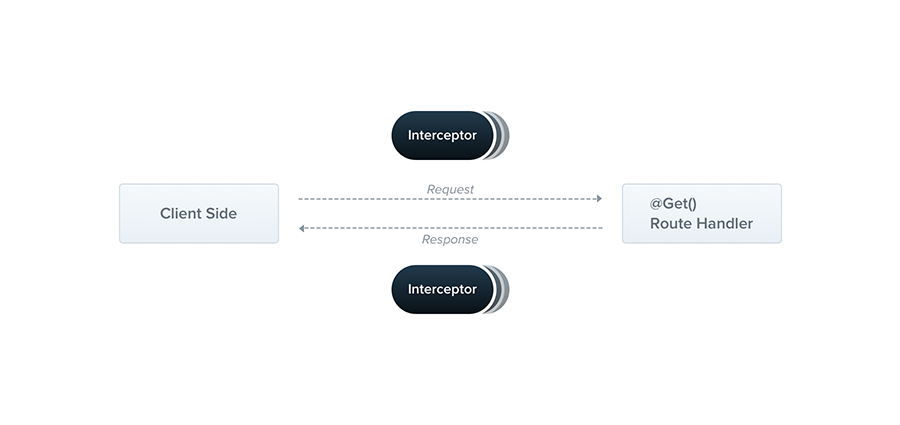

# 컨트롤러

컨트롤러는 들어오는 요청을 처리하고 클라이언트에 응답을 반환하는 역할을 합니다.

<figure><figcaption></figcaption></figure>

컨트롤러의 목적은 애플리케이션에 대한 특정 요청을 수신하는 것입니다. 라우팅 메커니즘은 각 컨트롤러가 어떤 요청을 수신할지 제어합니다. 각 컨트롤러에는 둘 이상의 경로가 있는 경우가 많으며, 경로마다 다른 작업을 수행할 수 있습니다.

기본 컨트롤러를 생성하기 위해 클래스와 **데코레이터**를 사용합니다. 데코레이터는 클래스를 필수 메타데이터와 연결하고 Nest가 라우팅 맵을 생성할 수 있도록 합니다.(Nest가 요청을 해당 컨트롤러에 연결)

> **힌트**
>
> 유효성 검사 기능이 내장된 CRUD 컨트롤러를 빠르게 생성하려면 CLI의 CRUD 생성기 `nest g resource [name]`를 사용할 수 있습니다.

### 라우팅

다음 예제에서는 기본 컨트롤러를 정의하는 데 필요한 `@Controller()` 데코레이터를 사용하고. cats 로 시작하는 경로를 지정합니다. `@Controller()` 데코레이터에 경로를 사용하면 관련 경로 집합을 쉽게 그룹화할 수 있고, 반복되는 코드를 최소화할 수 있습니다. 예를 들어 cat 엔티티와 상호 작용을 관리하는 일련의 경로를 `/cats` 경로 아래에 그룹화할 수 있습니다. 이 경우 `@Controller()` 데코레이터에 경로 `cats`를 지정하면 파일의 각 경로에 대해 해당 경로 부분을 반복할 필요가 없습니다.

```typescript
import { Controller, Get } from '@nestjs/common';

@Controller('cats')
export class CatsController {
  @Get()
  findAll(): string {
    return 'This action returns all cats';
  }
}
```

> **힌트**
>
> CLI를 사용하여 컨트롤러를 만들려면 `$ nest g controller [name]` 명령을 실행하면 됩니다.

`findAll()` 메서드 앞에 `@Get()` 데코레이터(HTTP 요청 메서드)를 사용하면 Nest가 HTTP 요청의 특정 엔드포인트에 대한 핸들러를 생성하도록 지시합니다. 엔드포인트는 HTTP 요청 메서드(이 경우 GET)와 라우팅 경로로 만들어집니다. 라우팅 경로는 이렇게 결정됩니다. 컨트롤러에 대해 선언된 경로(선택 사항)와 메서드의 데코레이터에 지정된 경로를 연결하여 결정됩니다. 모든 경로에 `cats`를 선언했고 데코레이터에 경로 정보를 추가하지 않았으므로 Nest는 `GET /cats` 요청을 이 핸들러에 매핑합니다. 앞서 언급했듯이 경로에는 컨트롤러에서 지정한 경로와 요청 메서드 데코레이터에 선언된 경로 문자열이 모두 포함됩니다. 예를 들어, 컨트롤러 경로 `cats`와 데코레이터 `@Get('breed')`를 결합하면 `GET /cats/breed`요청에 대한 경로 매핑이 생성됩니다.

위의 예시에서 이 엔드포인트로 GET 요청이 이루어지면 Nest는 요청을 사용자가 작성한 `findAll()` 메서드로 라우팅합니다. 여기서 선택한 메서드 이름은 완전히 임의적이라는 점에 유의하세요. 경로를 바인딩할 메서드를 선언해야 하지만 Nest는 선택한 메서드 이름에 어떤 의미도 부여하지 않습니다.

이 메서드는 200 상태 코드와 관련 응답을 반환하는데, 위의 예시에서는 문자열을 반환합니다. 이를 설명하기 위해 먼저 Nest가 응답을 조작하기 위해 두 가지 다른 옵션을 사용한다는 개념을 소개하겠습니다.

<table data-header-hidden><thead><tr><th width="109"></th><th></th></tr></thead><tbody><tr><td>표준 (권장됨)</td><td><p>이 기본 제공 메서드를 사용하면 요청 핸들러가 JavaScript 객체 또는 배열을 반환할 때 자동으로 JSON으로 직렬화합니다. 그러나 JavaScript의 기본 타입(예: <code>string</code>, <code>number</code>, <code>boolean</code>)을 반환하는 경우 Nest는 직렬화를 시도하지 않고 값만 전송합니다. 따라서 응답 처리가 간단해집니다. 값만 반환하면 나머지는 Nest가 알아서 처리합니다.</p><p>또한 응답의 상태 코드는 201을 사용하는 POST 요청을 제외하고는 기본적으로 항상 200입니다. 핸들러에서 <code>@HttpCode(...)</code> 데코레이터를 추가하여 이 동작을 쉽게 변경할 수 있습니다(상태 코드 참조).</p></td></tr><tr><td>라이브러리 맞춤</td><td>라이브러리에 맞춰(예: Express) 응답 객체를 사용할 수 있으며, 메서드 핸들러 시그니처에 <code>@Res()</code> 데코레이터를 사용하여 삽입할 수 있습니다(예: <code>findAll(@Res() response)</code>). 이 방식을 사용하면 해당 객체에 의해 노출된 기본 응답 처리 메서드를 사용할 수 있습니다. 예를 들어 Express를 사용하면 <code>response.status(200).send()</code> 같은 코드를 사용하여 응답을 구성할 수 있습니다.</td></tr></tbody></table>

> **주의**
>
> Nest는 핸들러가 `@Res()` 또는 `@Next()`를 사용하는 경우를 감지하여 라이브러리 맞춤 옵션을 선택했음을 나타냅니다. 두 방식을 동시에 사용하면 해당 단일 경로에 대해 표준 접근 방식이 **자동으로 비활성화되고** 더 이상 예상대로 작동하지 않습니다. 두 가지 접근 방식을 동시에 사용하려면(예: 응답 객체를 삽입하여 쿠키/헤더만 설정하고 나머지는 프레임워크에 맡기는 경우) `@Res({ passthrough: true })` 데코레이터에서 `passthrough` 옵션을 `true`로 설정해야 합니다.

### Request 객체

핸들러는 종종 클라이언트 요청의 세부 정보에 액세스해야 합니다. Nest는 기본 플랫폼(Express가 디폴트)의 request 객체 대한 액세스를 제공합니다. 핸들러 함수의 시그니처에 `@Req()` 데코레이터를 추가하여 Nest에 request 객체를 주입하도록 지시하면 request 객체에 액세스할 수 있습니다.

```typescript
import { Controller, Get, Req } from '@nestjs/common';
import { Request } from 'express';

@Controller('cats')
export class CatsController {
  @Get()
  findAll(@Req() request: Request): string {
    return 'This action returns all cats';
  }
}
```

> **힌트**
>
> `request: Request` 처럼 express `Reqeust` 타입을 활용하려면 `@types/express` 패키지를 import 해주세요.

request 객체는 HTTP 요청을 정보를 담고있습니다. request query string, parameter, HTTP header 및 Body에 대한 속성을 가지고 있습니다(자세한 내용은 [**여기를**](https://expressjs.com/en/api.html#req) 참조하세요). 대부분의 경우 이러한 속성을 수동으로 가져올 필요는 없습니다. 대신 바로 사용할 수 있는 `@Body()` 또는 `@Query()`와 같은 전용 데코레이터를 사용할 수 있습니다. 아래는 제공되는 데코레이터를 사용할 수 있습니다.

<table data-header-hidden><thead><tr><th width="264"></th><th></th></tr></thead><tbody><tr><td>데코레이터</td><td>express 객체</td></tr><tr><td><code>@Request(), @Req()</code></td><td><code>req</code></td></tr><tr><td><code>@Response(), @Res()</code>*</td><td><code>res</code></td></tr><tr><td><code>@Next()</code></td><td><code>next</code></td></tr><tr><td><code>@Session()</code></td><td><code>req.session</code></td></tr><tr><td><code>@Param(key?: string)</code></td><td><code>req.params</code> / <code>req.params[key]</code></td></tr><tr><td><code>@Body(key?: string)</code></td><td><code>req.body</code> / <code>req.body[key]</code></td></tr><tr><td><code>@Query(key?: string)</code></td><td><code>req.query</code> / <code>req.query[key]</code></td></tr><tr><td><code>@Headers(name?: string)</code></td><td><code>req.headers</code> / <code>req.headers[name]</code></td></tr><tr><td><code>@Ip()</code></td><td><code>req.ip</code></td></tr><tr><td><code>@HostParam()</code></td><td><code>req.hosts</code></td></tr></tbody></table>

\*HTTP 플랫폼(예: Express 및 Fastify)에서 타입 호환성을 위해 Nest는 `@Res()` 및 `@Response()` 데코레이터를 제공합니다. `@Res()`는 `@Response()`의 alias(별칭)입니다. 둘 다 네이티브 플랫폼 응답 객체 인터페이스를 직접 노출합니다. 이 두 데코레이터를 사용할 때는 기본 라이브러리의 타이핑(예: `@types/express`)도 import해야 타입의 장점을 최대한 활용할 수 있습니다. 메서드 핸들러에 `@Res()` 또는 `@Response()`를 삽입하면 해당 핸들러에 대해 Nest를 **라이브러리 전용 모드**로 전환하고 응답을 관리할 책임이 있다는 점에 유의하세요. 이 경우 응답 객체(예: `res.json(...)` 또는 `res.send(...)`)를 호출하여 어떤 종류의 응답을 발행해야 하며, 그렇지 않으면 HTTP 서버가 중단됩니다.

> **힌트**
>
> 나만의 사용자 지정 데코레이터를 만드는 방법을 알아보려면 이 장을 참조하세요.


### 리소스

앞서 `cats` 리소스를 가져오는 엔드포인트(**GET**)를 정의했습니다. 일반적으로 새 레코드를 생성하는 엔드포인트도 제공해야 합니다. 이를 위해 **POST** 핸들러를 만들어 보겠습니다.

```typescript
import { Controller, Get, Post } from '@nestjs/common';

@Controller('cats')
export class CatsController {
  @Post()
  create(): string {
    return 'This action adds a new cat';
  }

  @Get()
  findAll(): string {
    return 'This action returns all cats';
  }
}
```

아주 간단합니다. Nest는 모든 표준 HTTP 메서드에 대한 데코레이터를 제공합니다. `@Get()`, `@Post()`, `@Put()`, `@Delete()`, `@Patch()`, `@Options()`, `@Head()` 등입니다. 또한 `@All()`은 이 모든 메서드를 처리하는 엔드포인트를 정의합니다.


### Route 와일드카드

패턴 기반 경로도 지원됩니다. 예를 들어 별표는 와일드카드로 사용되며 어떤 문자 조합과도 일치합니다.

```typescript
@Get('ab*cd')
findAll() {
  return 'This route uses a wildcard';
}
```

`'ab*cd'` 경로 경로는 `abcd`, `ab_cd`, `abecd` 등과 일치합니다. 문자 `?`, `+`, `*` 및 `()`는 경로 경로에 사용할 수 있으며 정규표현식에 대응하는 문자입니다. 하이픈( `-` )과 점( `.` )은 문자열 기반 경로에서 문자 그대로 해석됩니다.

> **주의**
>
> 경로 중간에 있는 와일드카드는 익스프레스에서만 지원됩니다.


### 응답 상태 코드

앞서 언급했듯이 **응답 상태 코드**는 `201`인 POST 요청을 하면 기본적으로 항상 `200`입니다. 핸들러 수준에서 `@HttpCode(...)` 데코레이터를 추가하여 이 동작을 쉽게 변경할 수 있습니다.

```typescript
@Post()
@HttpCode(204)
create() {
  return 'This action adds a new cat';
}
```

> **힌트**
>
> `@nestjs/common` 패키지에서 `HttpCode`를 import 합니다.

상태 코드는 정적이지 않고 다양한 요인에 따라 달라지는 경우가 많습니다. 이 경우 라이브러리별 응답(`@Res()`를 사용하여 삽입) 객체를 사용할 수 있습니다. (오류가 나는 상황에서는  예외를 던지세요).


### 헤더

사용자 지정 응답 헤더를 지정하려면 `@Header()` 데코레이터 또는 라이브러리별 응답 객체를 사용하거나 `res.header()`를 직접 호출하면 됩니다.

```typescript
@Post()
@Header('Cache-Control', 'none')
create() {
  return 'This action adds a new cat';
}
```

> **힌트**
>
> `@nestjs/common` 패키지에서 `Header`를 import 합니다.


### 리디렉션

응답을 특정 URL로 리디렉션하려면 `@Redirect()` 데코레이터 또는 라이브러리 별 response 객체를 사용할 수 있습니다. (`res.redirect()`를 직접 호출할 수 있습니다.)

`@Redirect()`은 `url`과 `statusCode` 두 개의 인수를 받으며, 둘 다 선택 사항입니다. `statusCode`의 기본값은 `302`(`Found`)입니다.

```typescript
@Get()
@Redirect('https://nestjs.com', 301)
```

> 힌트
>
> HTTP 상태 코드나 리디렉션 URL을 동적으로 확인하고 싶을 수 있습니다. 이를 위해서는 (`@nestjs/common`에서 import한) `HttpRedirectResponse` 인터페이스를 따르는 객체를 반환하면 됩니다.

반환된 값은 `@Redirect()` 데코레이터에 전달된 모든 인수를 재정의합니다. 예시:

```typescript
@Get('docs')
@Redirect('https://docs.nestjs.com', 302)
getDocs(@Query('version') version) {
  if (version && version === '5') {
    return { url: 'https://docs.nestjs.com/v5/' };
  }
}
```


### Route 파라미터

정적 경로는 요청에서 동적 데이터를 받아들여야 할 때 작동하지 않습니다(예: ID가 1인 고양이를 가져오기 위한 `GET /cats/1`). 매개변수가 있는 경로를 정의하기 위해 경로 매개변수 토큰을 추가하여 요청 URL의 해당 위치에서 동적 값을 확인할 수 있습니다. 아래 `@Get()` 데코레이터 예시의 매개변수 토큰은 이 사용법을 보여줍니다. 메서드 시그니처에 `@Param()` 데코레이터를 추가하여 매개변수에 액세스할 수 있습니다.

> **힌트**
>
> 매개변수가 있는 경로는 모든 **정적 경로 뒤에** 선언해야 합니다. 이렇게 하면 매개변수화된 경로가 정적 경로로 향하는 트래픽을 가로채는 것을 방지할 수 있습니다.

```typescript
@Get(':id')
findOne(@Param() params: any): string {
  console.log(params.id);
  return `This action returns a #${params.id} cat`;
}
```

`@Param()`은 메소드 매개변수(위 예시의 params)를 데코레이팅하는 데 사용되며, **route** 매개변수를 메소드 내에서 데코레이팅된 메소드 매개변수의 속성으로 사용할 수 있게 합니다. 위 코드에서 볼 수 있듯이 `params.id`를 참조하여 id 매개변수에 액세스할 수 있습니다.&#x20;

> 힌트
>
> `@nestjs/common` 패키지에서 `Param`을 import 합니다.

데코레이터에 특정 매개변수 토큰을 전달할 수도 있으며(아래의 `'id'`, 그런 다음 메소드 본문에서 이름별로 라우트 매개변수를 직접 참조할 수 있습니다.

```typescript
@Get(':id')
findOne(@Param('id') id: string): string {
  return `This action returns a #${id} cat`;
}
```


### 서브도메인 라우팅&#x20;

`@Controller` 데코레이터는 `host` 옵션을 사용하여 들어오는 요청의 HTTP 호스트가 특정 값과 일치하도록 요구할 수 있습니다.

```typescript
@Controller({ host: 'admin.example.com' })
export class AdminController {
  @Get()
  index(): string {
    return 'Admin page';
  }
}
```

> **주의**
>
> Fastify는 중첩 라우터를 지원하지 않으므로 하위 도메인 라우팅을 사용할 때는 (기본값) Express 어댑터를 사용해야 합니다.

`path`와 비슷하게 `host` 옵션은 토큰을 사용하여 호스트 이름에서 해당 위치의 동적 값을 가져올 수 있습니다. 아래 `@Controller()` 데코레이터 예제에서 host 매개변수 토큰이 어떻게 사용될 수 있는지 확인할 수 있습니다. 이러한 방식으로 선언된 host 매개변수는 메서드 시그니처에 `@HostParam()` 데코레이터를 사용하여 액세스할 수 있습니다.

```typescript
@Controller({ host: ':account.example.com' })
export class AccountController {
  @Get()
  getInfo(@HostParam('account') account: string) {
    return account;
  }
}
```


### **Scopes**

다른 프로그래밍 언어 배경을 가진 사람들에게는 Nest에서는 들어오는 요청들 사이에서 거의 대부분의 것들이 공유된다는 사실이 의외로 느껴질 수 있습니다. 데이터베이스에 대한 연결 풀, 전역 상태를 가진 싱글톤 서비스 등이 있습니다. \
Node.js는 모든 요청이 별도의 스레드에서 처리되는 요청/응답 멀티 스레드 무상태(stateless) 모델을 따르지 않는다는 점을 기억하세요. 따라서 싱글톤 인스턴스를 사용하는 것은 애플리케이션에 완전히 안전합니다.

그러나 GraphQL 애플리케이션의 요청별 캐싱, 요청 추적 또는 멀티테넌시와 같이 컨트롤러의 요청 기반 수명이 바람직한 동작일 수 있는 엣지 케이스가 있습니다. 스코프를 제어하기 위한 방법은 **여기에서** 알아보세요.\


### 비동기성

우리는 모던 JavaScript를 사랑하며 데이터 추출이 대부분 **비동기적**이라는 것을 알고 있습니다. 그렇기 때문에 Nest는 비동기 함수를 지원하고 잘 작동합니다.

> **힌트**
>
> 비동기/대기 기능에 대한 자세한 내용은 [**여기**](https://kamilmysliwiec.com/typescript-2-1-introduction-async-await/)를 참조하세요.

모든 비동기 함수는 프로미스를 반환해야 합니다. 즉, Nest가 자체적으로 해결할 수 있는 지연된 값을 반환할 수 있습니다. 이에 대한 예를 살펴보겠습니다.

```typescript
@Get()
async findAll(): Promise<any[]> {
  return [];
}
```

위의 코드는 완전히 유효합니다. 또한 Nest 경로 핸들러는 RxJS [observable 스트림](https://reactivex.io/rxjs/class/es6/Observable.js\~Observable.html)을 반환할 수 있어 훨씬 더 강력합니다. Nest는 자동으로 아래 소스를 구독하고 (스트림이 완료되면) 마지막으로 방출된 값을 가져옵니다.

```typescript
@Get()
findAll(): Observable<any[]> {
  return of([]);
}
```

위의 두 가지 방법 모두 가능하며 스스로에게 적합한 방법을 사용하면 됩니다.


### Request Payloads

이전 예제에서 POST 라우트 핸들러는 클라이언트 매개변수를 사용하지 않았습니다. 여기에 `@Body()`데코레이터를 추가하여 이 문제를 해결해 보겠습니다.

하지만 먼저 (TypeScript를 사용하는 경우) **DTO**(데이터 전송 객체) 스키마를 정해야합니다. DTO는 데이터가 네트워크를 통해 전송되는 형태를 정의하는 객체입니다. **타입스크립트** 인터페이스 혹은 간단한 클래스를 사용하여 DTO 스키마를 결정할 수 있습니다. 흥미롭게도 여기서는 **클래스**를 사용하는 것이 좋습니다. 그 이유는 무엇일까요? 클래스는 JavaScript ES6 표준의 일부이므로 컴파일된 JavaScript에서 실제 엔티티로 보존됩니다. 반면에 TypeScript 인터페이스는 트랜스파일링 중에 제거되므로 Nest는 런타임에 이를 참조할 수 없습니다. 이는 파이프 같은 기능이 런타임의 변수 메타타입에 액세스할 수 있게 하기 때문에 중요합니다.

`CreateCatDto` 클래스를 만들어 보겠습니다:

```typescript
export class CreateCatDto {
  name: string;
  age: number;
  breed: string;
}
```

기본 속성은 세 가지입니다. 그런 다음 새로 생성된 DTO를 `CatsController` 내에서 사용할 수 있습니다:

```typescript
@Post()
async create(@Body() createCatDto: CreateCatDto) {
  return 'This action adds a new cat';
}
```

> 힌트&#x20;
>
> `ValidationPipe`는 메서드 핸들러가 수신해서는 안 되는 프로퍼티를 필터링할 수 있습니다. 이 경우 허용 가능한 속성을 화이트리스트에 추가할 수 있으며, 화이트리스트에 포함되지 않은 속성은 결과 객체에서 자동으로 제거됩니다. `CreateCatDto` 예제에서 화이트리스트는 `name`, `age`, `breed` 속성입니다. 여기에서 자세히 알아보세요.


### 에러 핸들링

오류 처리(즉, 예외 작업)에 대한 별도의 내용은 이 장을 참고하세요.


### 전체 리소스 샘플

아래는 사용 가능한 몇 가지 데코레이터를 사용하여 기본 컨트롤러를 만드는 예제입니다. 이 컨트롤러는 내부 데이터에 액세스하고 조작하는 몇 가지 메서드를 보여줍니다.

```typescript
import { Controller, Get, Query, Post, Body, Put, Param, Delete } from '@nestjs/common';
import { CreateCatDto, UpdateCatDto, ListAllEntities } from './dto';

@Controller('cats')
export class CatsController {
  @Post()
  create(@Body() createCatDto: CreateCatDto) {
    return 'This action adds a new cat';
  }

  @Get()
  findAll(@Query() query: ListAllEntities) {
    return `This action returns all cats (limit: ${query.limit} items)`;
  }

  @Get(':id')
  findOne(@Param('id') id: string) {
    return `This action returns a #${id} cat`;
  }

  @Put(':id')
  update(@Param('id') id: string, @Body() updateCatDto: UpdateCatDto) {
    return `This action updates a #${id} cat`;
  }

  @Delete(':id')
  remove(@Param('id') id: string) {
    return `This action removes a #${id} cat`;
  }
}
```

> **힌트**
>
> Nest CLI는 모든 기본 코드를 자동으로 생성하는 기능을 지원합니다. 이 모든 작업을 손수 하지 않아도 돼서 개발자 경험을 훨씬 좋게 만들어줍니다. CLI에 대한 자세한 내용은 여기에서 확인하세요.


### 시작 및 실행

위의 컨트롤러가 완전히 정의되었지만 Nest는 여전히 `CatsController`가 존재한다는 사실을 알지 못하므로 이 클래스의 인스턴스를 생성하지 않습니다.

컨트롤러는 항상 모듈에 속하기 때문에 `@Module()` 데코레이터 안에 컨트롤러 배열을 포함시킵니다. 루트 `AppModule`을 제외한 다른 모듈을 아직 정의하지 않았으므로 이를 사용하여 `CatsController`를 작동시키겠습니다.

```typescript
import { Module } from '@nestjs/common';
import { CatsController } from './cats/cats.controller';

@Module({
  controllers: [CatsController],
})
export class AppModule {}
```

`@Module()` 데코레이터를 사용하여 모듈 클래스에 메타데이터를 첨부했고, 이제 Nest에서 어떤 컨트롤러를 마운트할지 쉽게 설정할 수 있습니다.


### 라이브러리 맞춤 접근 방식

지금까지 Nest의 표준 응답 조작 방법에 대해 설명했습니다. 응답을 조작하는 두 번째 방법은 라이브러리 **response 객체**를 사용하는 것입니다. 특정 응답 객체를 삽입하려면 `@Res()` 데코레이터를 사용해야 합니다. 차이점을 보여주기 위해 `CatsController`를 다음과 같이 다시 작성해 보겠습니다:

```typescript
import { Controller, Get, Post, Res, HttpStatus } from '@nestjs/common';
import { Response } from 'express';

@Controller('cats')
export class CatsController {
  @Post()
  create(@Res() res: Response) {
    res.status(HttpStatus.CREATED).send();
  }

  @Get()
  findAll(@Res() res: Response) {
     res.status(HttpStatus.OK).json([]);
  }
}
```

위의 방식은 잘 작동하고 실제로 응답 객체에 대한 완전한 제어(헤더 조작, 라이브러리별 기능 등)를 제공함으로써 어떤 면에서는 더 많은 유연성을 허용합니다만 신중하게 사용해야 합니다. 일반적으로 이 접근 방식은 훨씬 덜 명확하며 몇 가지 단점이 있습니다. 가장 큰 단점은 코드가 플랫폼에 의존적하게 된다는 점입니다. (의존하는 라이브러리마다 응답 객체에 대한 API가 다를 수 있습니다.) 또한 테스트하기가 더 어려워집니다. (응답 객체를 모킹해야 하는 등의 문제.).

또한 위의 예제에서는 인터셉터, `@HttpCode()` / `@Header()` 데코레이터와 같이 Nest 표준 응답 처리에 의존하는 Nest 기능과의 호환성을 잃게 됩니다. 이 문제를 해결하려면 다음과 같이 `passthrough` 옵션을 `true`로 설정하면 됩니다:

```typescript
@Get()
findAll(@Res({ passthrough: true }) res: Response) {
  res.status(HttpStatus.OK);
  return [];
}
```

이제 원래의 응답 객체와 상호 작용할 수 있게 되었습니다.(예: 특정 조건에 따라 쿠키 또는 헤더 설정하는 작업에서) 하지만 나머지는 프레임워크에 맡기세요.&#x20;


