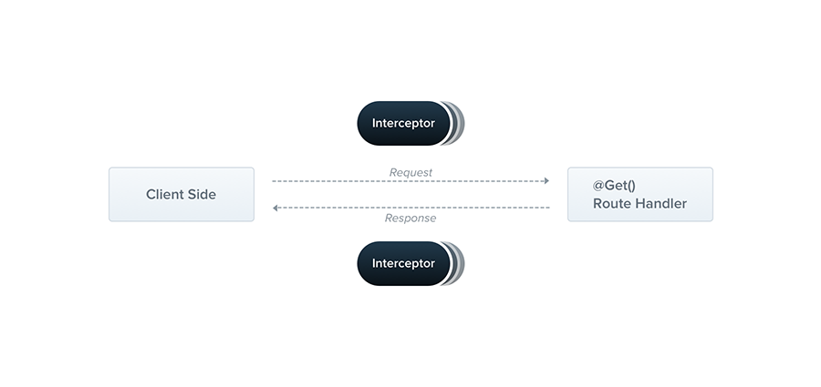

# 컨트롤러

컨트롤러는 들어오는 요청을 처리하고 클라이언트에 응답을 반환하는 역할을 합니다.

<figure><figcaption></figcaption></figure>

컨트롤러의 목적은 애플리케이션에 대한 특정 요청을 수신하는 것입니다. 라우팅 메커니즘은 어떤 컨트롤러가 어떤 요청을 수신할지 제어합니다. 각 컨트롤러에는 둘 이상의 경로가 있는 경우가 많으며, 경로마다 다른 작업을 수행할 수 있습니다.

기본 컨트롤러를 생성하기 위해 클래스와 **데코레이터**를 사용합니다. 데코레이터는 클래스를 필수 메타데이터와 연결하고 Nest가 라우팅 맵을 생성할 수 있도록 합니다.(요청을 해당 컨트롤러에 연결)

> **힌트**
>
> 유효성 검사 기능이 내장된 CRUD 컨트롤러를 빠르게 생성하려면 CLI의 CRUD 생성기 `nest g resource [name]`를 사용할 수 있습니다.


### 라우팅

다음 예제에서는 기본 컨트롤러를 정의하는 데 필요한 `@Controller()` 데코레이터를 사용하고. cats 로 시작하는 경로를 지정합니다. `@Controller()` 데코레이터에 경로를 사용하면 관련 경로 집합을 쉽게 그룹화하고 반복되는 코드를 최소화할 수 있습니다. 예를 들어 cat 엔티티와의 상호 작용을 관리하는 일련의 경로를 `/cats` 경로 아래에 그룹화할 수 있습니다. 이 경우 `@Controller()` 데코레이터에 경로 `cats`를 지정하면 파일의 각 경로에 대해 해당 경로 부분을 반복할 필요가 없습니다.

```typescript
import { Controller, Get } from '@nestjs/common';

@Controller('cats')
export class CatsController {
  @Get()
  findAll() {
    return 'This action returns all cats';
  }
}
```

> **힌트**
>
> CLI를 사용하여 컨트롤러를 만들려면 `$ nest g controller [name]` 명령을 실행하기만 하면 됩니다.

`findAll()` 메서드 앞에 `@Get()` 데코레이터(HTTP 요청 메서드)를 사용하면 Nest가 HTTP 요청의 특정 엔드포인트에 대한 핸들러를 생성하도록 지시합니다. 엔드포인트는 HTTP 요청 메서드(이 경우 GET)와 경로 경로에 해당합니다. 라우팅 경로는 이렇게 결정됩니다. 컨트롤러에 대해 선언된 경로(선택 사항)와 메서드의 데코레이터에 지정된 경로를 연결하여 결정됩니다. 모든 경로에 `cats`를 선언했고 데코레이터에 경로 정보를 추가하지 않았으므로 Nest는 `GET /cats` 요청을 이 핸들러에 매핑합니다. 앞서 언급했듯이 경로에는 컨트롤러에서 지정한 경로와 요청 메서드 데코레이터에 선언된 경로 문자열이 모두 포함됩니다. 예를 들어, 경로 `cats`와 데코레이터 `@Get('breed')`를 결합하면 `GET /cats/breed`와 같은 요청에 대한 경로 매핑이 생성됩니다.

위의 예시에서 이 엔드포인트로 GET 요청이 이루어지면 Nest는 요청을 사용자 정의된 `findAll()` 메서드로 라우팅합니다. 여기서 선택한 메서드 이름은 완전히 임의적이라는 점에 유의하세요. 경로를 바인딩할 메서드를 선언해야 하지만 Nest는 선택한 메서드 이름에 어떤 의미도 부여하지 않습니다.

이 메서드는 200 상태 코드와 관련 응답을 반환하는데, 위의 예시에서는 문자열을 반환합니다. 이를 설명하기 위해 먼저 Nest가 응답을 조작하기 위해 두 가지 다른 옵션을 사용한다는 개념을 소개하겠습니다.


<table data-header-hidden><thead><tr><th width="109"></th><th></th></tr></thead><tbody><tr><td>스탠다드 (권장됨)</td><td><p>이 기본 제공 메서드를 사용하면 요청 핸들러가 JavaScript 객체 또는 배열을 반환할 때 자동으로 JSON으로 직렬화됩니다. 그러나 JavaScript 기본 타입(예: <code>string</code>, <code>number</code>, <code>boolean</code>)을 반환하는 경우 Nest는 직렬화를 시도하지 않고 값만 전송합니다. 따라서 응답 처리가 간단해집니다. 값만 반환하면 나머지는 Nest가 알아서 처리합니다.</p><p>또한 응답의 상태 코드는 201을 사용하는 POST 요청을 제외하고는 기본적으로 항상 200입니다. 핸들러에서 <code>@HttpCode(...)</code> 데코레이터를 추가하여 이 동작을 쉽게 변경할 수 있습니다(상태 코드 참조).</p></td></tr><tr><td>라이브러리 맞춤</td><td>라이브러리별(예: Express) 응답 객체를 사용할 수 있으며, 메서드 핸들러 시그니처에 <code>@Res()</code> 데코레이터를 사용하여 삽입할 수 있습니다(예: <code>findAll(@Res() response)</code>). 이 방식을 사용하면 해당 객체에 의해 노출된 기본 응답 처리 메서드를 사용할 수 있습니다. 예를 들어 Express를 사용하면 <code>response.status(200).send()</code> 같은 코드를 사용하여 응답을 구성할 수 있습니다.</td></tr></tbody></table>

> **주의**
>
> Nest는 핸들러가 `@Res()` 또는 `@Next()`를 사용하는 경우를 감지하여 라이브러리별 옵션을 선택했음을 나타냅니다. 두 접근 방식을 동시에 사용하면 이 단일 경로에 대해 표준 접근 방식이 **자동으로 비활성화되고** 더 이상 예상대로 작동하지 않습니다. 두 가지 접근 방식을 동시에 사용하려면(예: 응답 객체를 삽입하여 쿠키/헤더만 설정하고 나머지는 프레임워크에 맡기는 경우) `@Res({ passthrough: true })` 데코레이터에서 `passthrough` 옵션을 `true`로 설정해야 합니다.


### Request 객체

핸들러는 종종 클라이언트 요청 세부 정보에 액세스해야 합니다. Nest는 기본 플랫폼(기본적으로 Express)의 요청 객체에 대한 액세스를 제공합니다. 핸들러의 서명에 `@Req()` 데코레이터를 추가하여 Nest에 요청 객체를 주입하도록 지시하면 요청 객체에 액세스할 수 있습니다.

```typescript
import { Controller, Bind, Get, Req } from '@nestjs/common';

@Controller('cats')
export class CatsController {
  @Get()
  @Bind(Req())
  findAll(request) {
    return 'This action returns all cats';
  }
}
```

> **힌트**
>
> 위의 요청: 요청 매개변수 예시에서와 같이 express 타입을 활용하려면 `@types/express` 패키지를 설치하세요.

request 객체는 HTTP 요청을 나타내며 요청 쿼리 문자열, 매개변수, HTTP 헤더 및 본문에 대한 속성을 가지고 있습니다(자세한 내용은 **여기를** 참조하세요). 대부분의 경우 이러한 속성을 수동으로 가져올 필요는 없습니다. 대신 바로 사용할 수 있는 `@Body()` 또는 `@Query()`와 같은 전용 데코레이터를 사용할 수 있습니다. 아래는 제공되는 데코레이터를 사용할 수 있습니다.

<table data-header-hidden><thead><tr><th width="264"></th><th></th></tr></thead><tbody><tr><td><code>@Request(), @Req()</code></td><td><code>req</code></td></tr><tr><td><code>@Response(), @Res()</code>*</td><td><code>res</code></td></tr><tr><td><code>@Next()</code></td><td><code>next</code></td></tr><tr><td><code>@Session()</code></td><td><code>req.session</code></td></tr><tr><td><code>@Param(key?: string)</code></td><td><code>req.params</code> / <code>req.params[key]</code></td></tr><tr><td><code>@Body(key?: string)</code></td><td><code>req.body</code> / <code>req.body[key]</code></td></tr><tr><td><code>@Query(key?: string)</code></td><td><code>req.query</code> / <code>req.query[key]</code></td></tr><tr><td><code>@Headers(name?: string)</code></td><td><code>req.headers</code> / <code>req.headers[name]</code></td></tr><tr><td><code>@Ip()</code></td><td><code>req.ip</code></td></tr><tr><td><code>@HostParam()</code></td><td><code>req.hosts</code></td></tr></tbody></table>


